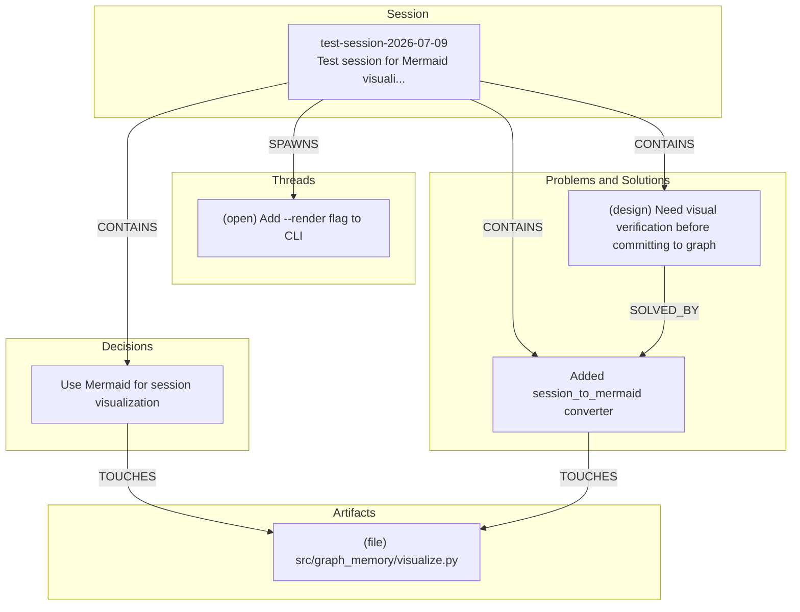

```mermaid
graph TD
    subgraph session [Session]
        S0["test-session-2026-07-09\nTest session for Mermaid visuali..."]
    end
    subgraph threads [Threads]
        T0["(open) Add --render flag to CLI"]
    end
    subgraph decisions [Decisions]
        D0["Use Mermaid for session visualization"]
    end
    subgraph problems_solutions [Problems and Solutions]
        P0["(design) Need visual verification before committing to graph"]
        Sol0["Added session_to_mermaid converter"]
    end
    subgraph artifacts [Artifacts]
        A0["(file) src/graph_memory/visualize.py"]
    end

    S0 -->|SPAWNS| T0
    S0 -->|CONTAINS| D0
    D0 -->|TOUCHES| A0
    S0 -->|CONTAINS| P0
    S0 -->|CONTAINS| Sol0
    P0 -->|SOLVED_BY| Sol0
    Sol0 -->|TOUCHES| A0
```